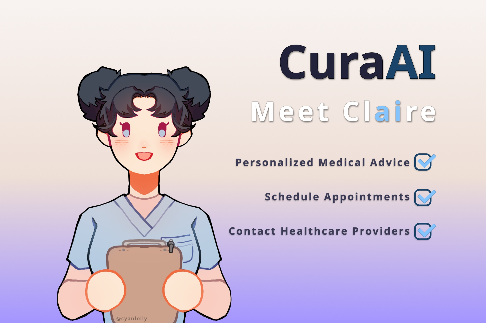

<div id="top"></div>

[![Contributors][contributors-shield]][contributors-url]
[![Forks][forks-shield]][forks-url]
[![Stargazers][stars-shield]][stars-url]
[![Issues][issues-shield]][issues-url]
[![GNU License][license-shield]][license-url]

<!-- PROJECT LOGO -->
<br />
<div align="center">
  <a href="https://github.com/101KiddChang010/mhacks-hackathon">
    
  </a>

<h3 align="center">CuraAI</h3>

  <p align="center">
    Your personalized AI medical assistant. Get accurate medical advice, quick diagnoses, and access to healthcare providers. Say goodbye to long wait times and hello to convenient healthcare assistance with Claire.
    <br />
    <a href="https://github.com/101KiddChang010/mhacks-hackathon"><strong>Explore the docs »</strong></a>
    <br />
    <br />
    <a href="">View Demo</a>
    ·
    <a href="https://github.com/101KiddChang010/mhacks-hackathon/issues">Report Bug</a>
    ·
    <a href="https://github.com/101KiddChang010/mhacks-hackathon/pulls">Request Feature</a>
  </p>
</div>

<!-- TABLE OF CONTENTS -->
<details>
  <summary>Table of Contents</summary>
  <ol>
    <li>
        <a href="#introducing-claire">Introducing Claire</a>
    </li>
    <li>
        <a href="#how-claire-works">How Claire Works</a>
    </li>
    <li>
        <a href="#inspiration">Inspiration</a>
    </li>
    <li>
        <a href="#accomplishments">Accomplishments</a>
    </li>
    <li>
        <a href="#challenges">Challenges</a>
    </li>
    <li>
        <a href="#what-we-learned">What We Learned</a>
    </li>
    <li>
        <a href="#what-is-next-for-curaai">What is next for CuraAI</a>
    </li>
    <li>
        <a href="#shoutout">Shoutout</a>
    </li>
    <li>
        <a href="#built-with">Built With</a>
    </li>
<!--<li><a href="#license">License</a></li>-->
    <li><a href="#contact">Contact</a></li>
  </ol>
</details>

## Introducing Claire

Your personalized AI medical assistant. Get accurate medical advice, quick diagnoses, and access to healthcare providers all in one place. Say goodbye to long wait times and hello to convenient healthcare management with Claire.

## How Claire Works

Claire is an innovative medical assistant AI that uses advanced natural language processing and artificial intelligence to help people manage their health. Developed with the state-of-the-art GPT-3 language model, Claire can understand and respond to natural language queries in a personalized and empathetic way. It can provide quick and accurate medical advice, schedule appointments, and connect patients with healthcare providers around the globe. With the ability to learn and adapt over time, Claire can become even more effective in providing patients with the most up-to-date and relevant information.

## Inspiration

In a world where access to healthcare can be limited and overwhelming, it's not uncommon for us to first search online about our symptoms. With the power of natural language processing and artificial intelligence, we can easily streamline and automate your healthcare needs. Imagine having a virtual medical assistant that could provide personalized accurate medical advice, schedule appointments, and connect you with healthcare providers. Having access to all of this at your fingertips would revolutionize the accessibility of the health industry for everyone.

### Accomplishments

As our first time working with machine learning, we are very proud to have created Claire despite originally knowing very little about learning models. It took some work to get Claire to behave in an intended way, but the process of training Claire and seeing it respond to instructions was mind-blowing. We are also very proud of the front-end design that beautifully wraps the project together.

### Challenges

Learning OpenAI's GPT3 API proved

### What We Learned

- Creating a custom AI with GPT-3
- Tailwind CSS Framework

### What is next for CuraAI

Claire is still in the early stage of development. We would like to add more features that would improve accessibility; Some examples are:

- Localize the AI to make it easily accessible to non-English speakers.

- Give it the ability to directly dial the local police in cases of medical emergencies.

- Despite the availability of accessibility, we may neglect our health due to busy schedules. In the future, incorporating an email and notification system to remind users to check in would be a valuable feature to consider.

### Shoutout

Huge shout out to the amazing artist [CyanLolly](https://www.instagram.com/cyanlolly/?hl=en) for helping us bring Claire to life! She's the one who masterfully designed and drew Claire's character. Without her this project wouldn't have been possible; Thank you so much!

### Built With


<p align="right">(<a href="#top">back to top</a>)</p>

<!-- GETTING STARTED -->
<!--
## Getting Started

This is an example of how you may give instructions on setting up your project locally.
To get a local copy up and running follow these simple example steps.

### Prerequisites

This is an example of how to list things you need to use the software and how to install them.
* npm
  ```sh
  npm install npm@latest -g
  ```

### Installation

1. Get a free API Key at [https://example.com](https://example.com)
2. Clone the repo
   ```sh
   git clone https://github.com/github_username/repo_name.git
   ```
3. Install NPM packages
   ```sh
   npm install
   ```
4. Enter your API in `config.js`
   ```js
   const API_KEY = 'ENTER YOUR API';
   ```

<p align="right">(<a href="#top">back to top</a>)</p>
-->

<!-- USAGE EXAMPLES -->
<!--
## Usage

Use this space to show useful examples of how a project can be used. Additional screenshots, code examples and demos work well in this space. You may also link to more resources.

_For more examples, please refer to the [Documentation](https://example.com)_

<p align="right">(<a href="#top">back to top</a>)</p>
-->

<!-- ROADMAP -->
<!--
## Roadmap

- [ ] Feature 1
- [ ] Feature 2
- [ ] Feature 3
    - [ ] Nested Feature

See the [open issues](https://github.com/github_username/repo_name/issues) for a full list of proposed features (and known issues).

<p align="right">(<a href="#top">back to top</a>)</p>
-->

<!-- CONTRIBUTING -->
<!--
## Contributing

Contributions are what make the open source community such an amazing place to learn, inspire, and create. Any contributions you make are **greatly appreciated**.

If you have a suggestion that would make this better, please fork the repo and create a pull request. You can also simply open an issue with the tag "enhancement".

1. Fork the Project
2. Create your Feature Branch (`git checkout -b feature/AmazingFeature`)
3. Commit your Changes (`git commit -m 'Add some AmazingFeature'`)
4. Push to the Branch (`git push origin feature/AmazingFeature`)
5. Open a Pull Request

<p align="right">(<a href="#top">back to top</a>)</p>
-->

<!-- LICENSE -->
<!--
## License

Distributed under the GNU General Public License v3.0 License. See `LICENSE.txt` for more information.

<p align="right">(<a href="#top">back to top</a>)</p>
-->

<!-- CONTACT -->

### Contact

Kidd Chang - [@github](https://github.com/101KiddChang010)

Bryan Lor - [@github](https://github.com/bryan-lor)

<p align="right">(<a href="#top">back to top</a>)</p>

<!-- ACKNOWLEDGMENTS -->
<!--
## Acknowledgments

* []()
* []()
* []()

<p align="right">(<a href="#top">back to top</a>)</p>
-->

<!-- MARKDOWN LINKS & IMAGES -->
<!-- https://www.markdownguide.org/basic-syntax/#reference-style-links -->

[contributors-shield]: https://img.shields.io/github/contributors/101KiddChang010/mhacks-hackathon.svg?style=for-the-badge
[contributors-url]: https://github.com/101KiddChang010/mhacks-hackathon/graphs/contributors
[forks-shield]: https://img.shields.io/github/forks/101KiddChang010/mhacks-hackathon.svg?style=for-the-badge
[forks-url]: https://github.com/101KiddChang010/mhacks-hackathon/network/members
[stars-shield]: https://img.shields.io/github/stars/101KiddChang010/mhacks-hackathon.svg?style=for-the-badge
[stars-url]: https://github.com/101KiddChang010/mhacks-hackathon/stargazers
[issues-shield]: https://img.shields.io/github/issues/101KiddChang010/mhacks-hackathon.svg?style=for-the-badge
[issues-url]: https://github.com/101KiddChang010/mhacks-hackathon/issues
[license-shield]: https://img.shields.io/github/license/101KiddChang010/mhacks-hackathon.svg?style=for-the-badge
[license-url]: https://github.com/101KiddChang010/mhacks-hackathon/blob/master/LICENSE.txt
[linkedin-shield]: https://img.shields.io/badge/-LinkedIn-black.svg?style=for-the-badge&logo=linkedin&colorB=555
